# YOLO V1  Algorithm

TUTORIAL BY ALADDIN PERSSON | <a href="https://www.youtube.com/watch?v=n9_XyCGr-MI&t=2224s">Link</a>

<a href="https://arxiv.org/pdf/1506.02640">YOLO V1 PAPER</a>

<a href ="https://www.kaggle.com/datasets/734b7bcb7ef13a045cbdd007a3c19874c2586ed0b02b4afc86126e89d00af8d2">DATASET</a>

- The idea of YOLO is to look at an image and be able to plot bounding boxes around the objects in the image, and be able to tell what those objects are, example below is two dogs.

Input Image: 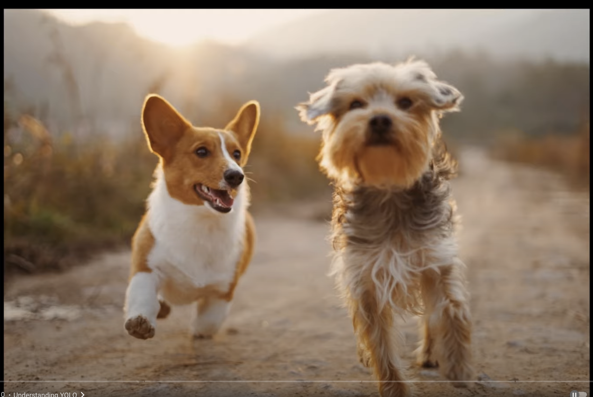

1. Then split the image into an SxS grid, example here is 3x3

Split Grid Image: 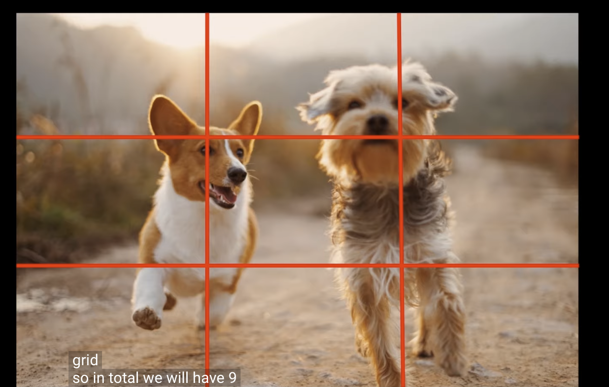

2. Now we have 9 cells.

3. The idea is that each cell will output a prediction with a corresponding bounding box bounding box.

4. We can see that each dog is in multiple cells, and so we want only one bounding box for each object, the idea is that we will find one cell that is responsible for that object.
    1. The cell that is responsible for outputing that objects bounding box will contain that objects mid-point.

        Mid-Point Example: 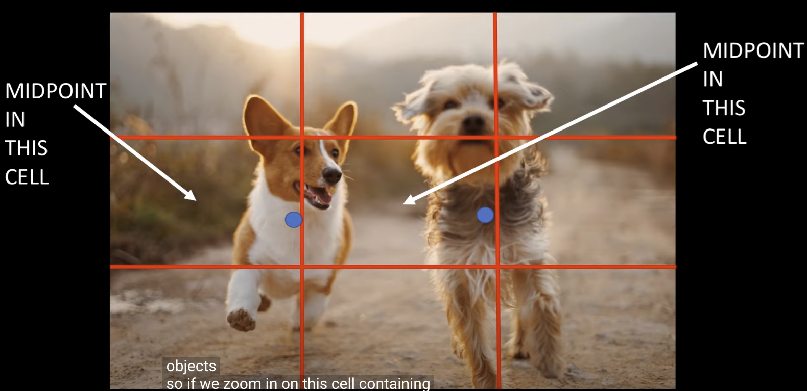

    2. Each output and label will be relative to the cell!

        One Cell: 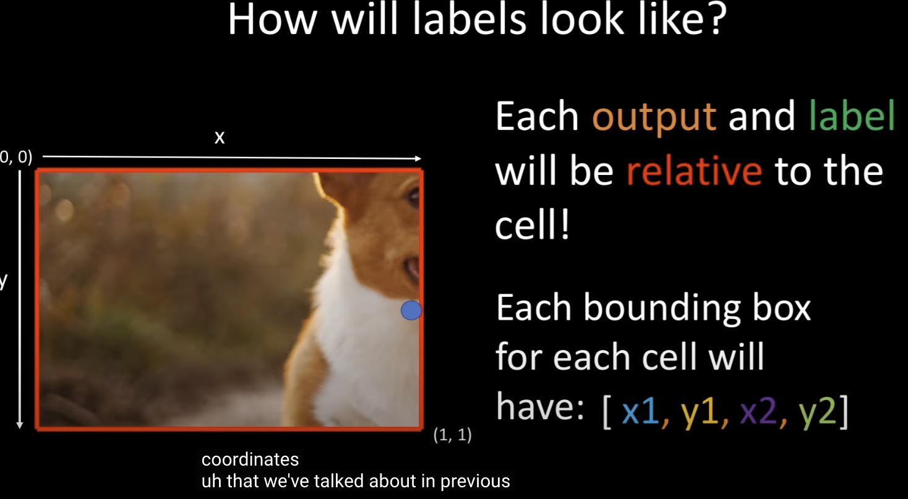
        1. The X, Y are the coordinates for the objects mid-point in that cell. The X, Y values are going to be between 0 and 1.
        2. The W, H are going to be the width and height of that object relative to the cell. The W and H can be greater than 1, becuase the object can be larger than the cell.
        3. In this one cell example the coordinates for the mid-point could be [0.95, 0.55, 0.5, 1.5]. X = 0.95 Y = 0.55, the width of the object is 0.5 of a total cell, the height is 1.5, so its 1.5 times the size of the cell.

        Output Example:  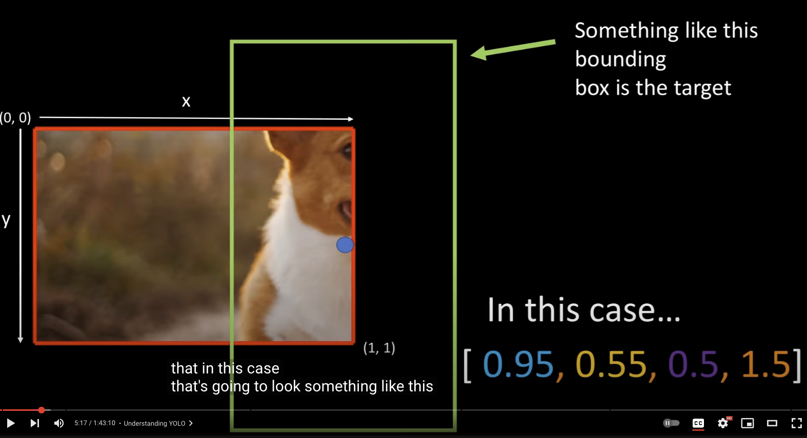

5. How the labels and Predictions will actually look?

    Labels look like:  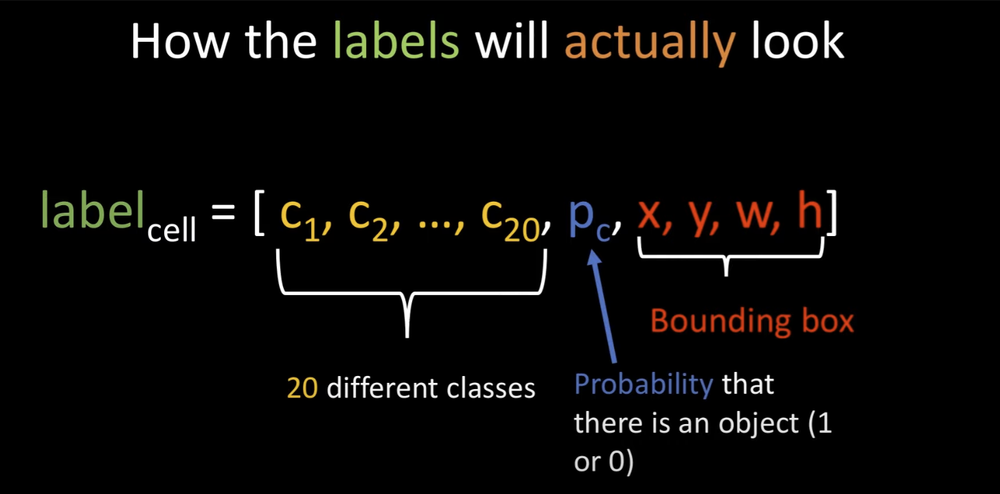

    1. 20 different classes of objects we are tring to predict in the dataset, Pc= probability that there is an object in that cell, and then the bounding boxes of that object. Predictions will look very similar, but we will ouput two bounding boxes instead of one, the idea: they will specialize to output different bounding boxes (wide vs tall).s

    Prediction Example:  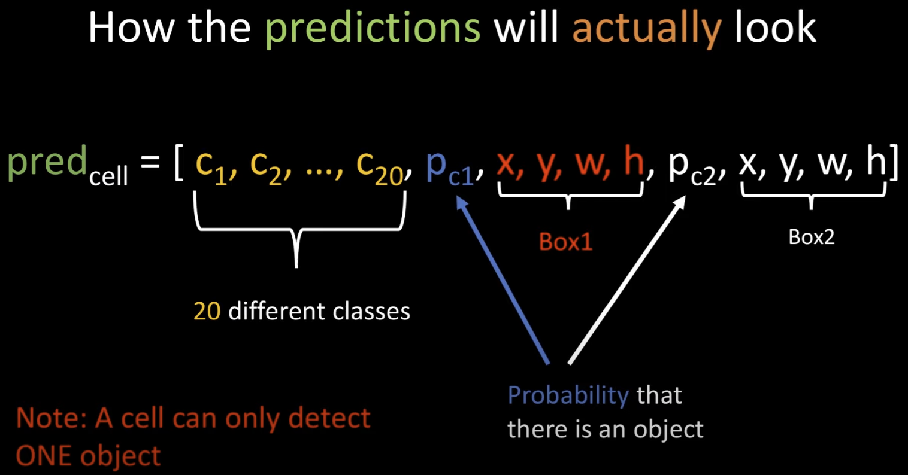

    2. NOTE: One caveat to YOLO is that a cell can only detect one object. A way to get around this is to make the grid finer, meaning from 3x3 to 19x19 etc.. of course this will need more compute power.
    3. Pc1 = probability that theres an object in first one predicted, Pc2 = probability that theres an object in second one predicted, then the box1 and box2 of those coordinates.

    
    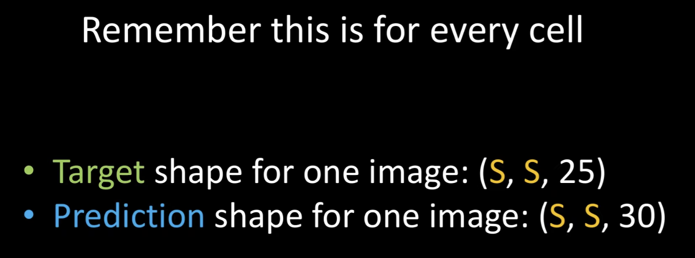
    
    4. Remeber this for every cell.
        1. Target shape: SxS= grid size, the 25 gets broken down into => 20 are for classes predictions + 1 is for the probability score + the remaining 4 are for the bounding boxes.
        2. Prediction Shape: very similar to the Target shape, except we will have 1 more probability score and 4 additional bounding boxes predictions. 25 + 1 + 4 = 30

6. Understand The Model Architecture And Implement in PyTorch

    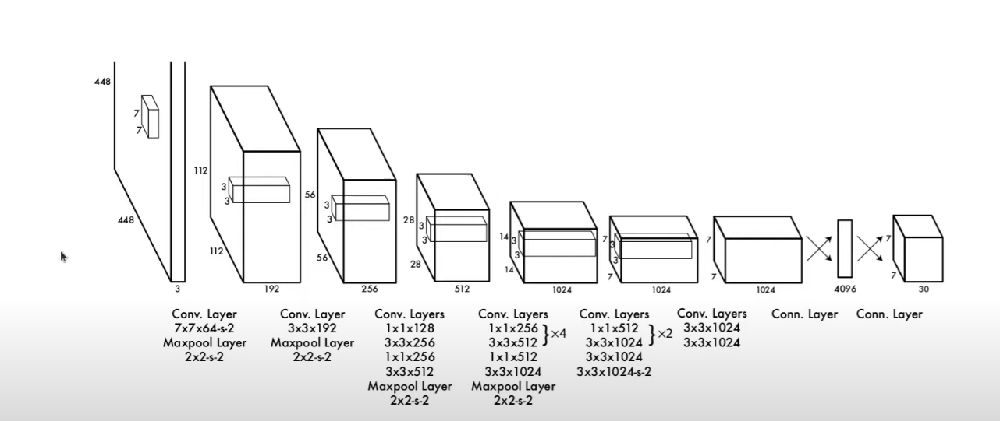

    1. Layer 1: Input will be (448 x 448 x 3), RBG images 448 pixels width by 448 height by 3 color channels.
        1. Passed into a Convolution Layer with 7x7 kernel with 64 output filters with a stride of 2. The stride of 2 will halve the image size.
        2. Then a maxpool 2x2 with a stride of 2.
        3. Note: the strides are halving the layers. We input a 448x448 image then the first CONV layer halves it to 224x224 then the maxpool halves it again into 112x112 which is the input size for the next layer. And the padding will be the same for all layers. Also the color channel = 3 x 63 output filters of the first CONV will result into 192.
    2. Layer 2
        1. Passed into a CONV layer with 3x3 kernal with 192 output filters
        2. Passed into a maxpool layer of 2x2 with a stride of 2.
    3. Layer 3
        1. Passed into sequential CONV layers [ 1 x 1 x 128] => [ 3 x 3 x 256] => [ 1 x 1 x 256] => [ 3 x 3 x 512]
        2. Passed to a maxpool 2x2 with a stride of 2.
    4. Layer 4
        1. Repeat this CONV layers 4 times => [1 x 1 x 256] => [ 3 x 3 x 512 ]
        2. then CONV layers [ 1 x 1 x 512 ] => [ 3 x 3 x 1024]
        3. Add a maxpool with 2x2 and a stride of 2
    5. Layer 5
        1. Repeat this CONV layers 2 times => [1 x 1 x 512] => [ 3 x 3 x 1024 ]
        2. then CONV layers [ 3 x 3 x 1024] => [ 3 x 3 x 1024, stride = 2]
    6. Layer 6
        1. Conv layers [3 x 3 x 1024] => [ 3 x 3 x 1024]
    7. Layer 7
        1. input is 7 x 7 x 1024 and the below connected layer reshapes it into a 4096.
        2. Add a Connected layer with a feature vector of 4096, NOTE: a connected layer is also called a fully connected layer or dense layer. 
    8. Layer 8
        1. Add a Connected layer to reshape into a 7 x 7 x 30
    9. NOTE: 
        1. The 7 x 7 x 30 for layer 8 means => we are going to have a 7 x 7 grid so ( S x S) of the image
        2. Then for each cell theres going to be a 30 vector output, like mentioned at [line item 5.4](#item-54).]
    10. Using this info we create the model in model.py 

7. Loss Function

    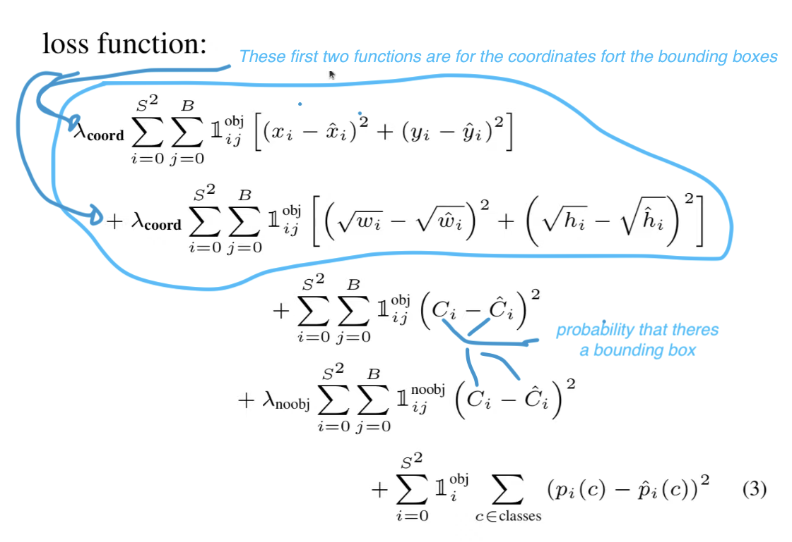

     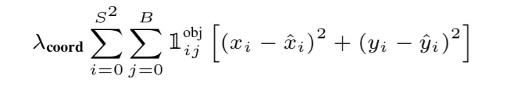 

    1. ↑ The xi is the box coordinate for the mid-point
        1. ( taking the mid-point value xi - and subtracting it with the predicted $\hat{x}$i ) 
        2. then square it ()2
        3. plus (yi - predicted $\hat{y}$i)2
        4. $\frac{obj}{i  j}$ is an identity function, it makes sure that we only run that function if theres an object in the cell and also if the bounding box j is responsible for outputing  that bounding box.
        5. The result of the identity function is either 1 or 0. It's going to be 1 if theres a box in cell i and then i=o is going to become equal to s2
        6. Then we need a requirment that bounding box j is responsible for oupting that bounding box this is where j=0
        7. Now we need to know which cell is responsible for outputing that bounding box 
        8. Then multiply with λcoord | (lamba = λ which is a constant) 

    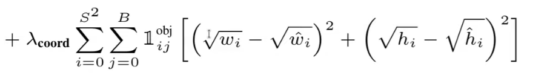 

    2. ↑ This function is similar to the one above but now we are working with bounding box 
        1. here we take the square root to make sure we prioritize smaller bounding boxes just as much as we do for large bounding boxes 
        2. we also have the lambda and the identity function here as well.

    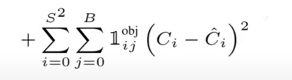 

    3. ↑ This function is if there is an object in the cell. C in this function stands for the probability that theres a bounding box  in the cell.
        1. We have two bounding box for the predicted
        2. Here were only going to take the bounding box with the highest IOU.

    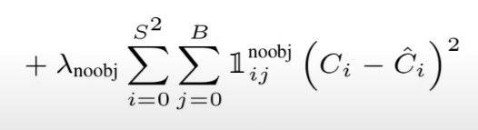 

    4. ↑ This function is if there is NO object in the cell. noobj = no object

    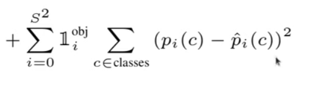 
    
    5. ↑ This function is for the classes.
        1. it runs the identity function => it goes through each cell and looks to see if theres an object there in cell i
        2. then we go thru each class all of the 20 classes
        3. we take the sum squared error, the YOLO V1 paper uses a regression based loss for everything
    6. Implement the loss function is loss.py

8. Dataset
    1. In the label files of the dataset, one example:
            

            "11 0.34419263456090654 0.611 0.4164305949008499 0.262"
            

            

            "14 0.509915014164306 0.51 0.9745042492917847 0.972"
            
 
        1. you can resize the image with no problems because the bounding boxes are percentages and will resize correctly.
        2. the 11 and 14 above are the classes
        3.  0.3441.... is the mid-point
        4. 0.611 0.416.... 0.262 are the coordinates of the bounding box
        5. this image would have two bounding boxes of two classes 11 and 14.

    2. in the train.csv files example: 000005.jpg,000005.txt
        1. just tells us which images go with what labels

<!-- CSS CODE BELOW -->

