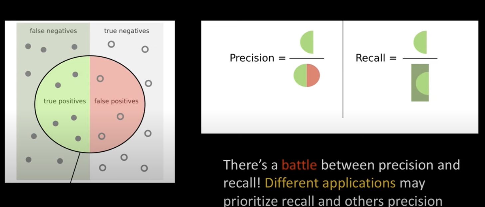
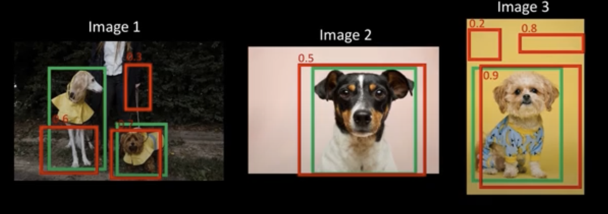
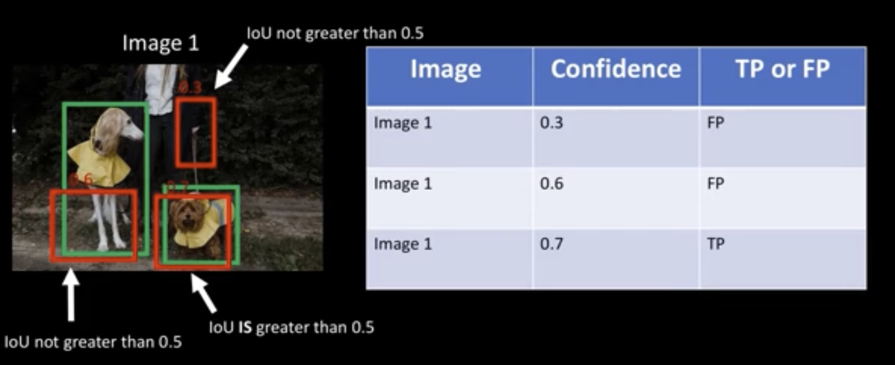
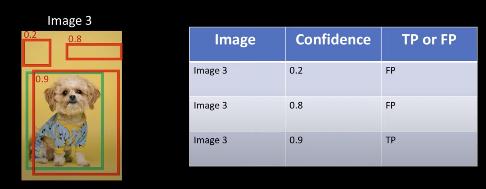
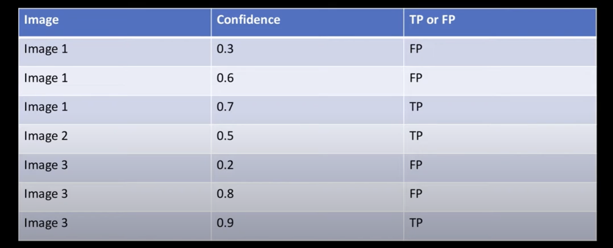
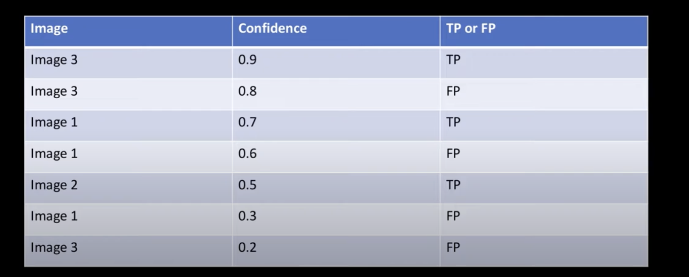
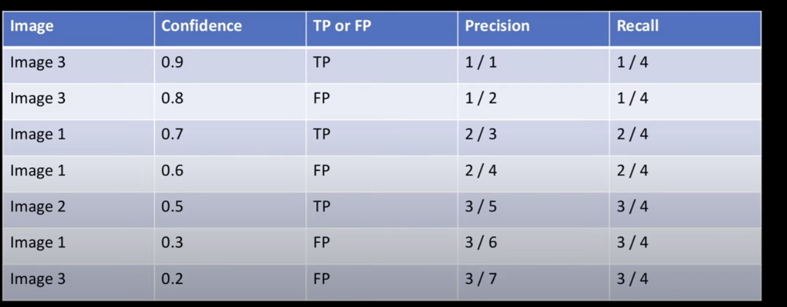
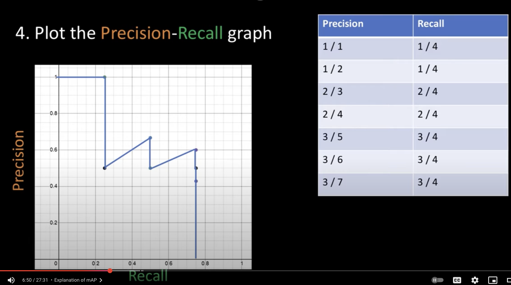
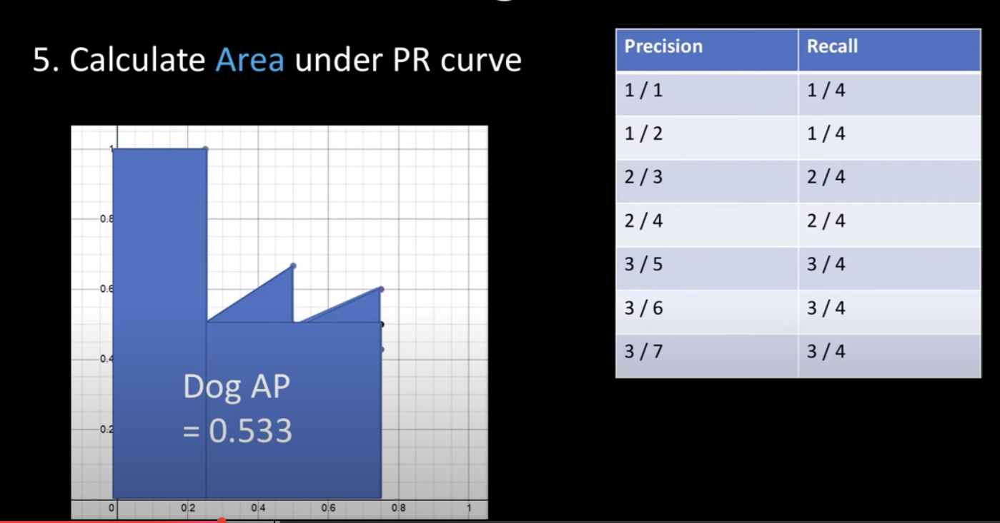

# Mean Average Precision

- **Purpose**: Mean Average Precision (mAP) is a robust metric used to evaluate the performance of object detection models. It accounts for both the accuracy of object classification and the precision of their localization.

- **mAP** = mean average precision.

- It is typically computed at training time on the validation dataset, i.e., for every epoch that we train the model on the train dataset, we test it on the validation dataset.

- **Prerequisites**:
    - Understand IoU (Intersection Over Union): A metric that quantifies the overlap between two bounding boxes.

<!-- TODO: Add link to Yolov1_orig only implemented. -->

## Key Concepts For TP/FP Determination:

- FP = False positives, TP = True positives
- IoU Threshold: A predicted bounding box is considered a match if its Iou with a ground truth bounding box is above a predefined threshold (commonly 0.5).
- Correct Class: In addition to the IoU threshold, the predicted bounding box must also have the correct class label to be considered a True Positive.

- One-to-One Matching: If multiple predicted bounding boxes overlap with the same ground truth bounding box (all above the IoU threshold and correct class), only the one with the highest confidence score is counted as a True Positive. The others are considered False Positives.

### Understanding Precision  and Recall.

1. True positives: are predicted bounding boxes that correctly match a Target bounding box (i.e., IoU > threshold and correct class).
2. False positives: means the model predicted a bounding box, but there was no target bounding box, or it was a duplicate detection for an already matched ground truth (i.e., a wrong prediction).
3. A False negatives is a ground truth object that the model failed to detect. (i.e., a missed detection).

3. Precision: Take the True Positives and divide by the (True Positives + False **Positives**).
    - Interpretation: Of all bounding box predictions made by the model, what fraction was actually correct?

    - $$ Precision = \frac{TP}{TP + FP}$$

4. Recall Take the True Positives and divide it by the (True Positives + False **Negatives**).
    - Interpretation: Of all actual target bounding boxes present, what fraction did the model correctly detect?
    - $$ Recall = \frac{TP}{TP + FN}$$

5. There's a battle between Precision and Recall! Different applications may prioritize Recall and others Precision. For example, self-driving cars prioritize not missing any pedestrians, so they would value having a high Recall more than Precision (though both are crucial).

## Steps In mAP

- For our example, let's assume there are a **total** of 4 ground truth dog bounding boxes across all images. **Our model made** 7 bounding box predictions.

1. Get all bounding boxes predictions on our VALIDATION set.

    
    
    1. The green bboxes are the target boxes and the red are the predicted bounding boxes.

        

        

        - For image 3, we have a predicted bounding boxes with a 0.9 confidence score, which has a high IoU (greater than 0.5), so that's a True positive.

2. Create a table with all the scores and TP/FP labels for all predicted bounding boxes from each image (e.g., the dog pink background, the raincoat dogs, and the little dog yellow background).

    

    1. Sort the table by descending confidence score.

    

3. Calculate the Precision and Recall as we go through all predicted output bounding boxes from the model.

    

    1. Explanation: Cumulative TP and cumulative FP are calculated as we go through the sorted table, building the Precision-Recall curve point by point.

        - For the **first** row the bounding box is in image 3: 
            - a confidence score of 0.9
            - A cumulative *TP* = 1
            - A cumulative *FP* = 0
            - $Precision = \frac{1}{1+0}=1/1$ (Because our prediction so far has been 100% accurate)
            - $Recall = \frac{1}{4}$ (Assuming 4 total ground truth bounding boxes across all images, we've correctly predicted 1 out of 4)

        - For the **Second** row the bounding box is also in image 3: 
            - a confidence score of 0.8
            - A cumulative *TP* = 1
            - A cumulative *FP* = 1
            - $Precision = \frac{1}{1+1}=1/2$ (Because we have only correctly predicted one out of two predictions made so far)
            - $Recall = \frac{1}{4}$ (Correct, as we haven't predicted any more correctly yet)
        - The **third** row is a *TP*, so $Precision = \frac{2}{3}$ and $Recall = \frac{2}{4}$.

4. Plot The Recall-Precision graph.

    

    1. **Calculate Area Under PR Curve.**
        - The Area Under the Precision-Recall Curve (AP) represents the average precision across all recall values. It's often approximated by summing precision values at specific recall levels (e.g., 11-point interpolation for PASCAL VOC) or by taking a weighted average of precisions achieved at each threshold (all-point interpolation for COCO).
        - For a single class (e.g., "Dog"), let's say the **Dog AP = 0.533**.

    

    2. **Calculate Mean Average Precision (mAP) for multiple classes.**
        1. We have been **only** predicting dogs in this example dateset. But when we are predicting for more than one class, we need to calculate mAP for each class. 
            - Example dataset cats and dogs:
                - Cat AP = 0.74
                - Dog AP = 0.533  
                - mAP $= (0.533 + 0.74) / 2 = 0.63645$

5. What if we wanted to compute mAP for many IoU values, e.g. $IoUs = [0.5, 0.55, 0.6, ..., 0.95]$.
    - Then we calculate mAP for each value save the results in a list then average the list and this will be out final result. 
    - The final result for metrics like **mAP@0.5:0.05:0.95** is the average of these individual mAP scores computed at each IoU threshold within the specified range. 
        - For example, **mAP@0.5:0.05:0.95** is the average mAP for IoU thresholds of 0.5, 0.55, ..., 0.95 (10 different thresholds). This provides a more robust evaluation of detection performance across varying localization strictness.

<!--  -->
<!-- Precision -->
<!-- Recall -->
<!-- False positives -->
<!-- False positives -->

<!-- CSS BELOW -->
