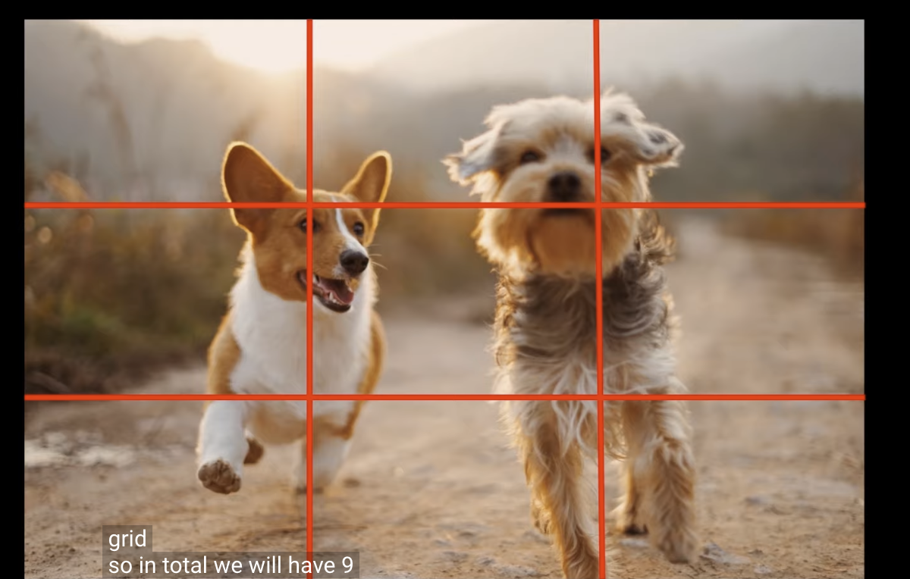
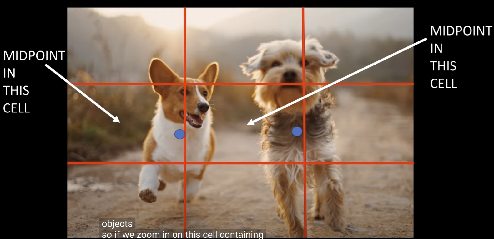
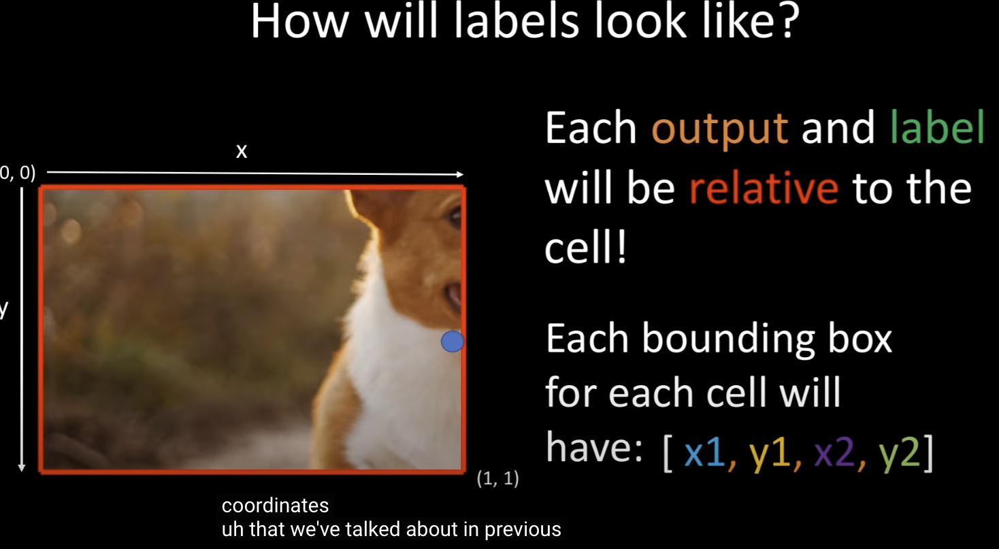
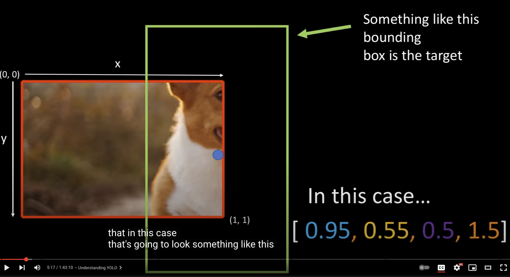
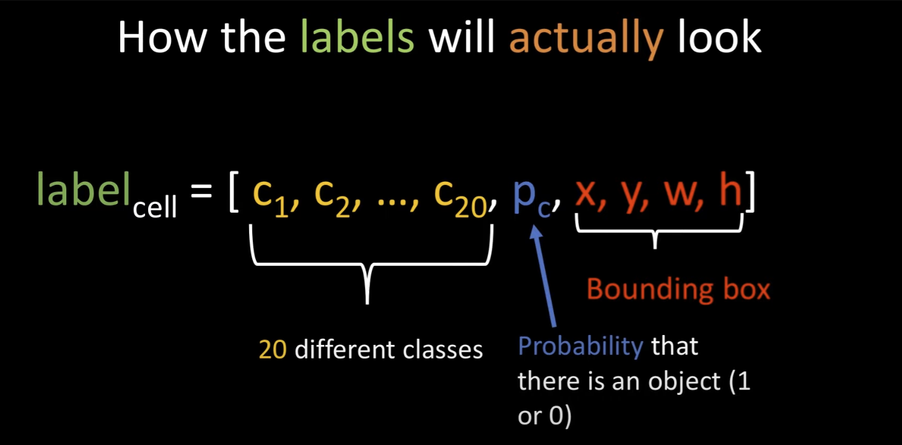
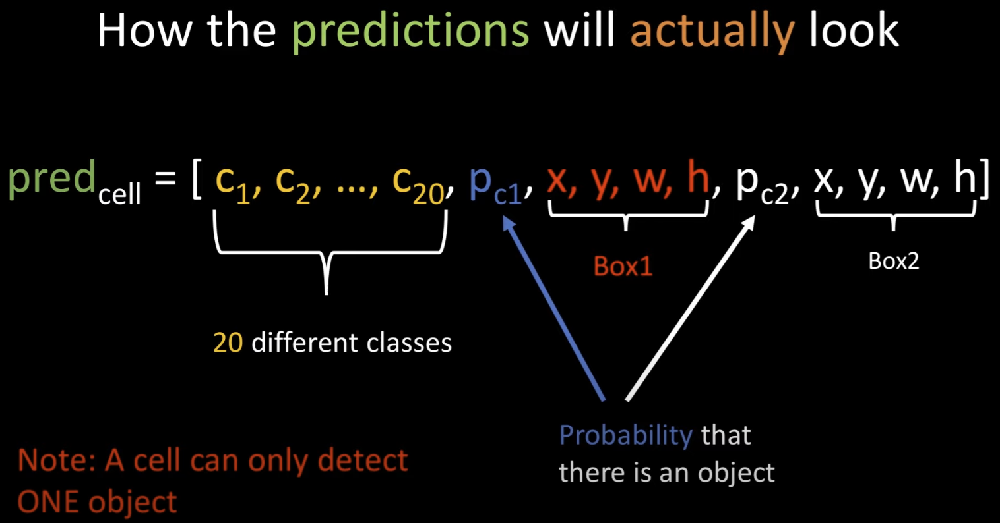
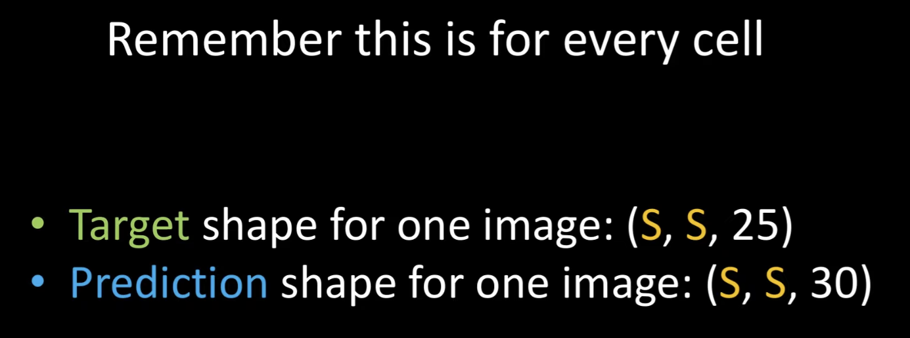

# YOLO V1  Algorithm

TUTORIAL BY ALADDIN PERSSON | <a href="https://www.youtube.com/watch?v=n9_XyCGr-MI&t=2224s">Link</a>

<a href="https://arxiv.org/pdf/1506.02640">YOLO V1 PAPER</a>

<a href ="https://www.kaggle.com/datasets/734b7bcb7ef13a045cbdd007a3c19874c2586ed0b02b4afc86126e89d00af8d2">DATASET</a>

- The idea of YOLO is to look at an image and be able to plot bounding boxes around the objects in the image, and be able to tell what those objects are, example below is two dogs.

Input Image: 

1. Then split the image into an SxS grid, example here is 3x3

Split Grid Image: 

2. Now we have 9 cells.

3. The idea is that each cell will output a prediction with a corresponding bounding box bounding box.

4. We can see that each dog is in multiple cells, and so we want only one bounding box for each object, the idea is that we will find one cell that is responsible for that object.
    1. The cell that is responsible for outputing that objects bounding box will contain that objects mid-point.

        Mid-Point Example: 

    2. Each output and label will be relative to the cell!

        One Cell: 
        1. The X, Y are the coordinates for the objects mid-point in that cell. The X, Y values are going to be between 0 and 1.
        2. The W, H are going to be the width and height of that object relative to the cell. The W and H can be greater than 1, becuase the object can be larger than the cell.
        3. In this one cell example the coordinates for the mid-point could be [0.95, 0.55, 0.5, 1.5]. X = 0.95 Y = 0.55, the width of the object is 0.5 of a total cell, the height is 1.5, so its 1.5 times the size of the cell.

        Output Example:  

5. How the labels and Predictions will actually look?

    Labels look like:  

    1. 20 different classes of objects we are tring to predict in the dataset, Pc= probability that there is an object in that cell, and then the bounding boxes of that object. Predictions will look very similar, but we will ouput two bounding boxes instead of one, the idea: they will specialize to output different bounding boxes (wide vs tall).s

    Prediction Example:  

    2. NOTE: One caveat to YOLO is that a cell can only detect one object. A way to get around this is to make the grid finer, meaning from 3x3 to 19x19 etc.. of course this will need more compute power.
    3. Pc1 = probability that theres an object in first one predicted, Pc2 = probability that theres an object in second one predicted, then the box1 and box2 of those coordinates.

    
    
    
    4. Remeber this for every cell.
        1. Target shape: SxS= grid size, the 25 gets broken down into => 20 are for classes predictions + 1 is for the probability score + the remaining 4 are for the bounding boxes.
        2. Prediction Shape: very similar to the Target shape, except we will have 1 more probability score and 4 additional bounding boxes predictions. 25 + 1 + 4 = 30

6. **Understand The Model Architecture And Implement in PyTorch**

    ⭐ Check out Notes on [Archietcure](https://github.com/t20e/AI_public_projects/tree/main/object_detection/yolo_v1_orig#yolo-v1-architecture).

    ⭐ [Architecture code implementation](https://github.com/t20e/AI_public_projects/blob/main/object_detection/yolo_v1_orig/model/yolov1.py).

7. **Loss Function**

   ⭐ Check out on [notes loss function](https://github.com/t20e/res/blob/main/coding.res/AI.res/object_detection/YOLO_v1.res/loss_fn.ipynb).

   ⭐ [Loss function Code implementation](https://github.com/t20e/AI_public_projects/blob/main/object_detection/yolo_v1_orig/model/loss.py).

<!-- CSS CODE BELOW -->

