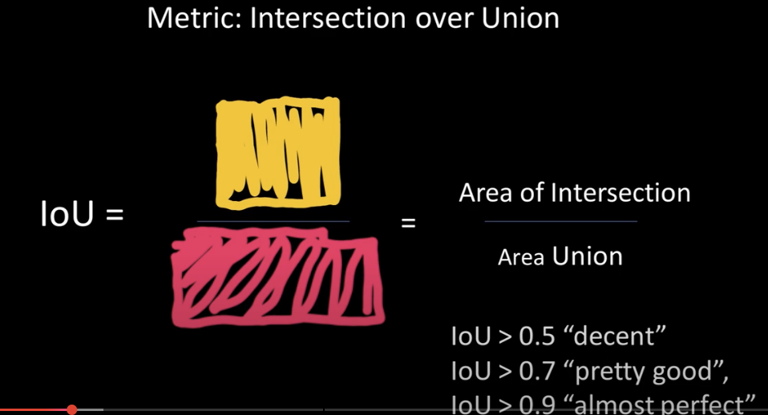
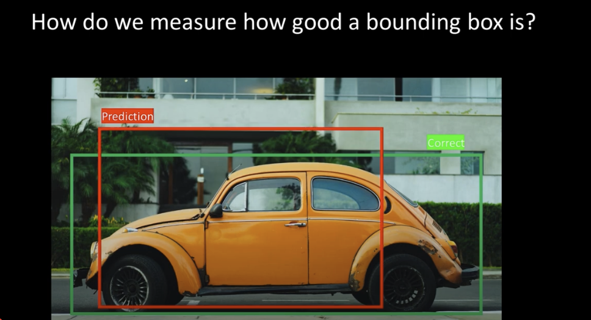
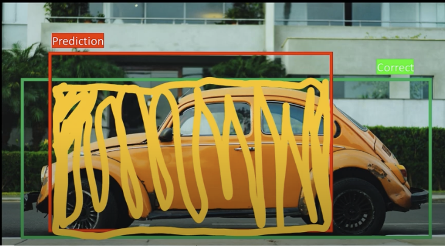
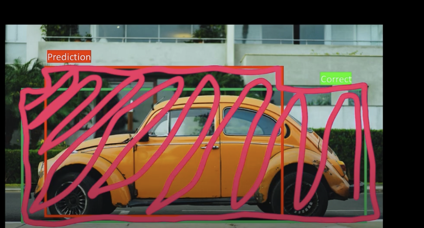
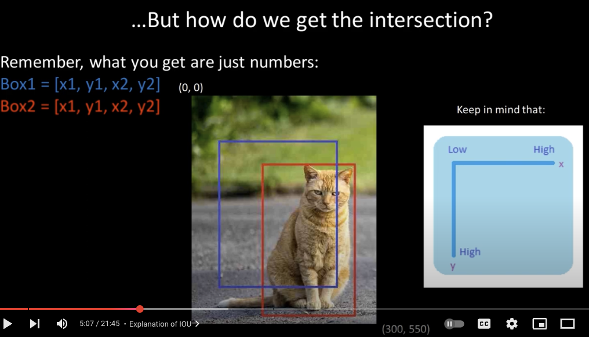
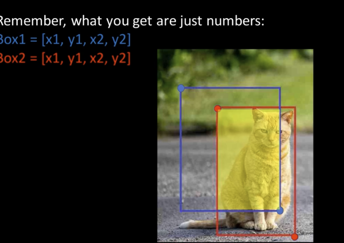
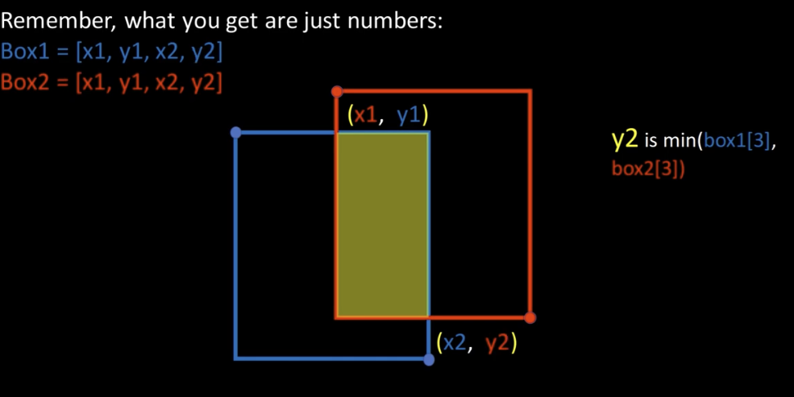
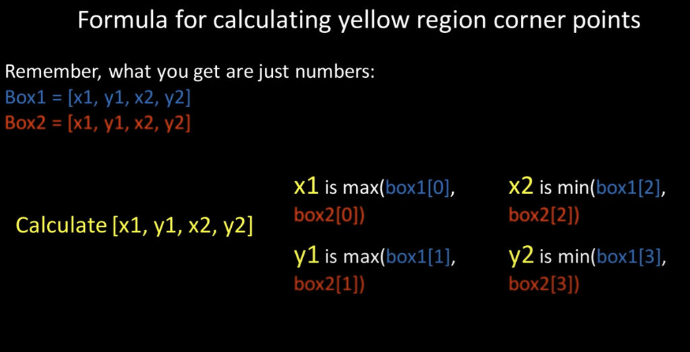

# IoU | Intersection Over Union

Prerequisite: [Understand Coordinate Formats](https://github.com/t20e/res/blob/main/coding.res/AI.res/object_detection/understand_corner_and_mid_points.md)

**Implementation:** See YOLO_v1_orig repo or ./utils/IOU.py and IOU-test.py

Question : how do we measure how good a bounding box is?

The IOU score will be between 0 and 1. The **higher** the IOU score the more the boxes are overlapping.

   

The green box is the Target/True label for that car object

### Applying IOU

1. Calculate the intersection between the predicted and the correct bboxes

    1. That is the yellow draw box

2. Then Calculate the Union, which is just the area of both those bounding boxes

    1. Which is the pink drawn box

### More examples

image example is 300,550

Now we look for this yellow box, which is the corner points of the intersection over the two bounding boxes

This if for finding the corner points of the yellow intersection box, then we need to calculate the area and the union  

------------------------------------------------------------------------------------------

Note: another IOU img example, unrelated to above

