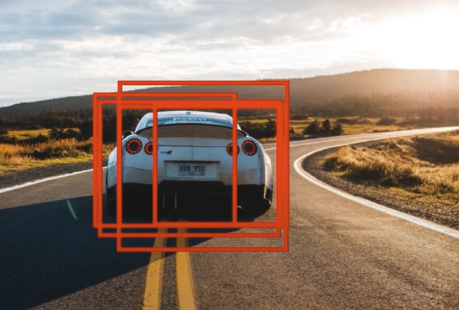
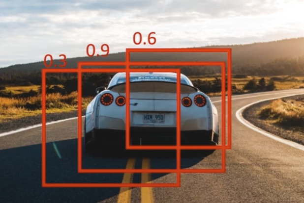

# Non-max Suppression

⭐️ If you don't know what **IoU** is check this [Resource](https://github.com/t20e/res/blob/main/coding.res/AI.res/object_detection/YOLO_v1.res/intersection_over_union.ipynb).

* **NMS** is used to remove redundant bounding boxes after predictions are made.
* **IOU_threshold** is a float value [0-1]. We use it when comparing bounding boxes, if the IoU result is greater than IOU_threshold than the box with the lower confidence score is removed. Note: the higher than IoU the more the boxes overlap.

**Before:** NMS.  

**After:** NMS.  

## Steps of NMS

**Note**: If we have image classes example ['dog', 'cat', etc..], then we need to compute NMS for each class separately. So if a dog and a cat bounding box overlap we don't perform NMS on them.

1. **Before** we perform **NMS**, we remove any bounding boxes with a confidence score/probability score (pc) less than **MIN_THRESHOLD**.  

2. Example: Three predicted bounding boxes.  

    

    - Each of bounding box has a probability score [0.3, 0.9, 0.6]. The probability is between [0-1] and it indicates how likely that there is an object in that bounding box.

3. We get the bounding box with the highest (pc) which in this case is the one with a (0.9) probability.  

    

4. Then we compare it with the other boxes that have a lower probability, and we calculate the IOU between them.

    

    1. Example: IoU between box (0.9) vs box (0.6) = 0.51.
        1. If the result (0.51) is greater than an IOU_threshold ex:0.5 then we remove the box with the lower confidence score (0.6).

    2. Then we compare box (0.9) and box (0.3) = 0.6.
        1. If the result is less than the IOU_threshold ex:0.5, the box with the lower confidence score is not suppressed by the current highest confidence box.

<!-- ADD LINK TO NMS on yolov1_orig -->