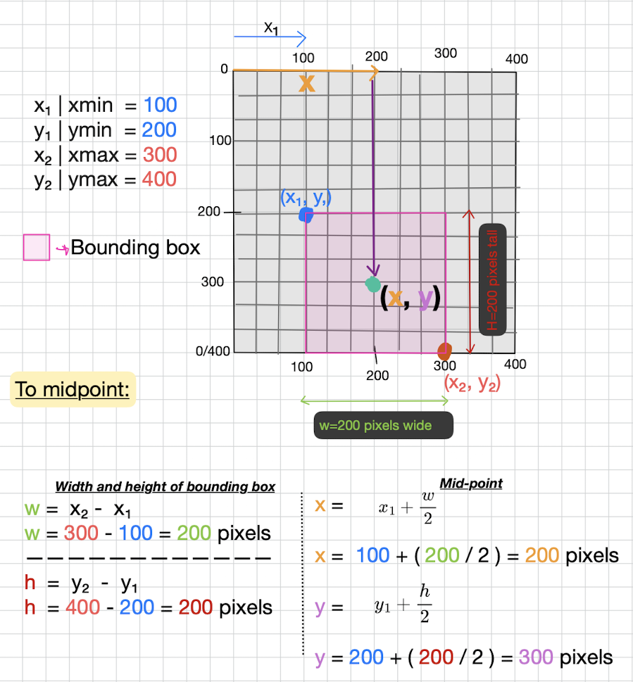

# Understanding Bounding Box Coordinate Formats

There are two types of bounding box (bbox) coordinate formats: **mid-point** and **corner-points**.

### Vocab

**Absolute pixel values:** Direct pixel measurements. Fixed to image resolution; *Doesn't resize well.*

**Percentage values (normalized):** Proportional measurements (0-1 range). *Scales automatically with image resizing.*

### Mid-point format: `(x, y, w, h)`  

* The `x`, `y` represent the (mid/center) point of the bounding box.  

* `w` and `h` represent the width and height of the bounding box.

### Corner-points format: `(x_min, y_min, x_max, y_max)`  

* Can also be noted as `(x₁, y₁, x₂, y₂)`.
* `x_min`, `y_min` represents the top-left corner of the bounding box.  

* `x_max`, `y_max` represent the bottom-right corner.  
* These coordinates are typically relative to the **entire image**.
* Corner-points is often used during postprocessing steps such as **IoU calculation**, **visualization**, and **Non-Max-Suppression**.

### Easily Resize-able

* It does not matter whether the bounding box coordinates are represented as **corner-points** (x₁, y₁, x₂, ₂y) or **mid-points** (x, y, w, h) as long as they are expressed as **percentages** (normalized values between 0 and 1) and relative to the entire image dimensions you can resize any image without having to worry about messing up the bounding box coordinates.

### How To converted?

***Note:** Examples use absolute pixel values, but the same conversion formulas apply for both absolute pixel values and percentage coordinates.*

**Corner-points to midpoints: ↓**

